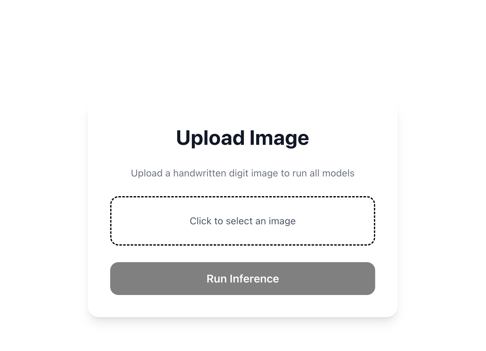
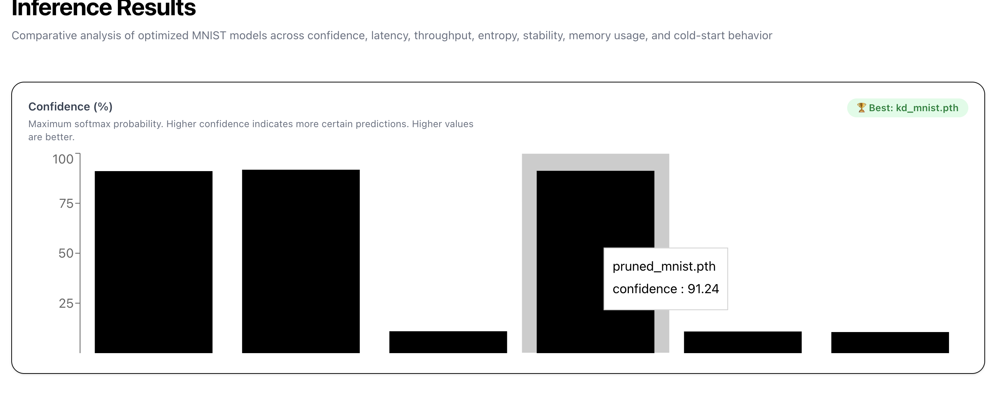
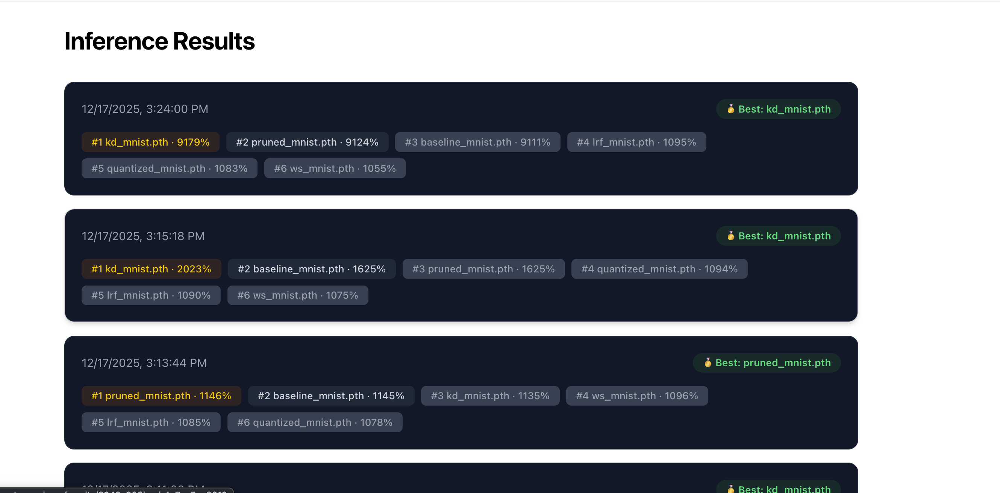
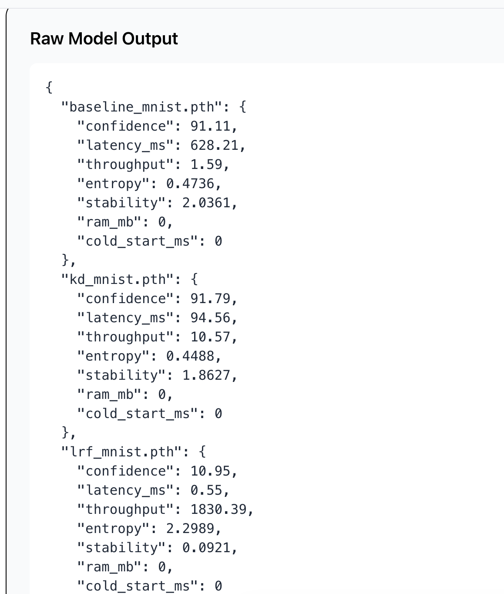
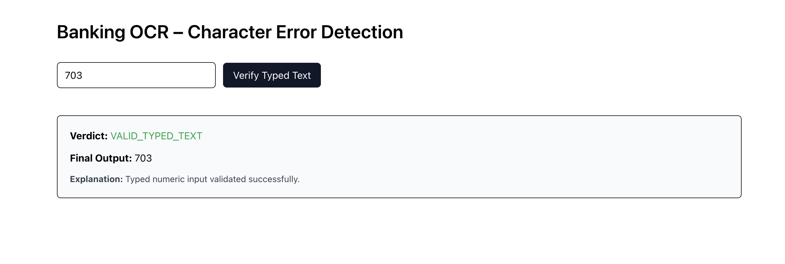
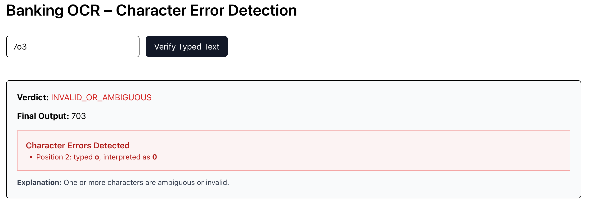

# FinCheck  
FinCheck is a full-stack system for benchmarking optimized convolutional neural network (CNN) models on the MNIST dataset and for verifying handwritten numeric input using OCR. The system is designed for research, performance analysis, and real-world numeric verification workflows.

The platform is:
- Research-grade
- Production-deployable
- Cross-platform (Windows, macOS, Linux)
- Docker and cloud ready (Render and Vercel)

---

## Problem Statement

Handwritten numeric input is widely used in financial, banking, and identity verification systems. However, such input introduces two major challenges:

### 1. Model Trade-offs  
Different CNN optimization techniques such as pruning, quantization, and knowledge distillation significantly impact:
- Accuracy
- Inference latency
- Memory usage
- Output stability

### 2. Input Ambiguity  
Users may type numeric input that does not match the handwritten image, leading to:
- Misclassification
- Security vulnerabilities
- Invalid or failed transactions

---

## Proposed Solution

“We implement a lightweight segmentation-based OCR pipeline as a preprocessing step, while keeping the CNN architecture unchanged.”

FinCheck addresses these challenges by combining systematic model benchmarking with OCR-based numeric input verification.

### Model Benchmarking
- Executes multiple optimized MNIST CNN variants
- Collects per-model metrics:
  - Confidence
  - Latency
  - Throughput
  - Entropy
  - Stability
  - RAM usage
  - Cold-start time

### OCR-Based Verification
- Uses Tesseract OCR
- Validates user-typed numeric input against handwritten images
- Detects:
  - Ambiguous characters
  - Length mismatches
  - OCR failures
- Always returns structured JSON responses

---

## System Architecture

```text
Frontend (Next.js + TypeScript)
 ├─ Upload handwritten digit
 ├─ Run inference
 ├─ Visualize metrics
 └─ Verify typed input (OCR)

Backend (FastAPI + PyTorch)
 ├─ POST /run     → Model inference and benchmarking
 ├─ POST /verify  → OCR-based verification
 └─ GET  /health  → Service health check

 screenshot/
├── correct-ocr.png
├── history.png
├── image-upload.png
├── inference1.png
├── rawoutput.png
└── wrong-ocr.png


Database (MongoDB Atlas)
 └─ Stores inference results
```
---
## Application Screenshots

### Image Upload Interface
This interface allows users to upload a handwritten digit image for inference and verification.


---

### Inference Results and Model Comparison
This view displays comparative performance metrics across all optimized MNIST models.


---

### Inference History
Previously executed inference runs are stored and can be reviewed for comparison and analysis.


---

### Raw Model Output
This section shows the raw JSON output returned by the backend for transparency and reproducibility.


---

### OCR Verification – Correct Input
Example of successful OCR verification where typed input matches the handwritten image.


---

### OCR Verification – Incorrect or Ambiguous Input
Example showing OCR-detected ambiguity or mismatch between handwritten input and typed text.


---

## Tech Stack

### Backend

* Python 3.12
* FastAPI
* PyTorch
* torchvision
* pytesseract
* psutil
* Pillow

### Frontend

* Next.js (App Router)
* TypeScript
* Recharts
* Tailwind CSS

### DevOps

* Docker
* Render (backend deployment)
* Vercel (frontend deployment)
* MongoDB Atlas

---

## Environment Variables

Create a `.env.local` (frontend) or `.env` (local development):

```env
MONGODB_URI=mongodb+srv://<user>:<password>@<cluster>.mongodb.net/
MONGODB_DB=finalyear

NEXTAUTH_URL=https://fincheck-next.vercel.app
NEXTAUTH_SECRET=<your-secret>

INFERENCE_API_URL=http://localhost:8000
```

Never commit secrets to version control. Use platform-managed environment variables in production.

---

### Generating `NEXTAUTH_SECRET` (Cross-Platform)

`NEXTAUTH_SECRET` is used by NextAuth.js to encrypt session data and sign authentication tokens. It must be a cryptographically secure random value and should remain constant across deployments.

#### Cross-Platform (Recommended)

Using Node.js (works on Windows, macOS, and Linux):

```sh
node -e "console.log(require('crypto').randomBytes(32).toString('hex'))"
````

---

#### Alternative Cross-Platform Method (Python)

```sh
python - <<EOF
import secrets
print(secrets.token_hex(32))
EOF
```

---

#### Platform-Specific Alternatives

**macOS / Linux (OpenSSL):**

```sh
openssl rand -hex 32
```

**Windows (PowerShell):**

```powershell
[System.Guid]::NewGuid().ToString("N") + [System.Guid]::NewGuid().ToString("N")
```

---

#### Usage

Copy the generated value and add it to your environment configuration:

```env
NEXTAUTH_SECRET=generated_secure_random_value
```

---

#### Important Notes

* The secret should be at least **32 bytes** long
* Do not regenerate the secret after deployment, as this will invalidate active sessions
* Never commit secrets to version control
* In production, define this value using the platform’s environment variable settings (e.g., Vercel, Render)


---

## Running Locally (Without Docker)

### Clone the Repository

```sh
git clone https://github.com/<your-username>/fincheck.git
cd fincheck
```

---

### Backend Setup

```sh
cd backend
python -m venv venv
source venv/bin/activate        # macOS / Linux
venv\Scripts\activate           # Windows
```

Install dependencies:

```sh
pip install -r requirements.txt
```

#### Install Tesseract OCR

**macOS**

```sh
brew install tesseract
```

**Ubuntu / Debian**

```sh
sudo apt install tesseract-ocr
```

**Windows**

* Download from [https://github.com/UB-Mannheim/tesseract/wiki](https://github.com/UB-Mannheim/tesseract/wiki)
* Add Tesseract to PATH
* Verify installation:

```sh
tesseract --version
```

Run the backend server:

```sh
uvicorn server:app --reload
```

Backend will be available at:

```
http://localhost:8000
```

---

### Frontend Setup

```sh
cd ../
pnpm install
pnpm dev
```

Frontend will be available at:

```
http://localhost:3000
```

---

## Running with Docker (Recommended)

### Build the Backend Image

```sh
docker build -t fincheck-backend .
```

### Run the Backend Container

```sh
docker run -p 8000:8000 fincheck-backend
```

Verify the service:

```sh
curl http://localhost:8000/health
```

---

## Model Management

Models are downloaded at Docker build time and packaged inside the container image:

```text
/app/model/
  baseline_mnist.pth
  kd_mnist.pth
  lrf_mnist.pth
  pruned_mnist.pth
  quantized_mnist.pth
  ws_mnist.pth
```

This ensures:

* Fast startup
* No runtime downloads
* Deterministic deployments

---

## Visualization and Metrics

Each visualization:

* Explains the metric being displayed
* Clearly states whether higher or lower values are better
* Automatically identifies the best-performing model per metric

The visualization layer is suitable for academic reports, performance analysis, and optimization studies.

---

## API Reference

### POST `/run` — Model Inference and Benchmarking

Runs inference on all optimized MNIST CNN variants and returns performance metrics.

#### Request

| Field | Type | Required | Description             |
| ----- | ---- | -------- | ----------------------- |
| image | File | Yes      | Handwritten digit image |

Content-Type: `multipart/form-data`

#### Response (Example)

```json
{
  "baseline_mnist.pth": {
    "confidence": 98.73,
    "latency_ms": 4.21,
    "throughput": 237.53,
    "entropy": 0.0421,
    "stability": 0.3114,
    "ram_mb": 1.82,
    "cold_start_ms": 0
  }
}
```

#### Metrics Description

| Metric        | Description                 | Preferred |
| ------------- | --------------------------- | --------- |
| confidence    | Maximum softmax probability | Higher    |
| latency_ms    | Inference time per image    | Lower     |
| throughput    | Images per second           | Higher    |
| entropy       | Prediction uncertainty      | Lower     |
| stability     | Logit standard deviation    | Lower     |
| ram_mb        | RAM usage during inference  | Lower     |
| cold_start_ms | Initial load overhead       | Lower     |

---

### POST `/verify` — OCR-Based Input Verification

Validates typed numeric input against a handwritten image.

#### Request

| Field    | Type   | Required | Description               |
| -------- | ------ | -------- | ------------------------- |
| image    | File   | Yes      | Handwritten numeric image |
| raw_text | String | Yes      | User-typed numeric input  |

#### Response (Example)

```json
{
  "verdict": "VALID_TYPED_TEXT",
  "final_output": "123",
  "errors": []
}
```

The endpoint always returns JSON and never returns an empty response.

---

### GET `/health` — Service Health

```json
{
  "status": "ok",
  "mnist_loaded": true
}
```

---
## Methodology

### Dataset and Preprocessing

The MNIST handwritten digit dataset is used for all experiments. Input images are converted to grayscale, resized to 28×28 pixels, and normalized to the [0,1] range. The same preprocessing pipeline is applied uniformly across all models to ensure a fair and consistent comparison.

### Model Architecture

All evaluated models share an identical convolutional neural network (CNN) architecture. As a result, any observed differences in performance arise exclusively from the applied optimization techniques rather than architectural variations. The architecture consists of convolutional layers with ReLU activations, max-pooling layers, and a fully connected classification head with softmax output.

### Optimization Techniques

The following optimization strategies are evaluated:

| Variant   | Description                 |
| --------- | --------------------------- |
| Baseline  | Standard CNN                |
| KD        | Knowledge Distillation      |
| LRF       | Low-Rank Factorization      |
| Pruned    | Structured weight pruning   |
| Quantized | Reduced precision inference |
| WS        | Weight sharing              |

Each model variant is trained and evaluated under identical experimental conditions.

### Inference and Metrics

Inference is performed under controlled and identical runtime conditions for all models. Performance metrics such as inference latency, prediction entropy, and RAM usage are measured on a per-request basis. Throughput is computed as the inverse of measured latency, providing an estimate of the number of samples processed per second.

### OCR Verification Pipeline

To validate numeric user input, handwritten images are processed using Tesseract OCR with digit-only constraints. The OCR output is compared character-by-character with the user-typed input to detect mismatches, ambiguous characters, and length inconsistencies. This verification pipeline operates independently of the CNN inference process, ensuring a clear separation between recognition and validation.

### Deployment and Reproducibility

All models are packaged at Docker build time, eliminating runtime dependencies and ensuring deterministic deployments. The backend operates within a containerized environment, while the frontend communicates through stable API contracts. Deployment configuration is fully controlled via environment variables, enabling reproducible experiments and production-safe operation.

---

## Result

The proposed system provides a robust, reproducible, and extensible framework for evaluating optimized CNN models and validating handwritten numeric input in real-world scenarios.
